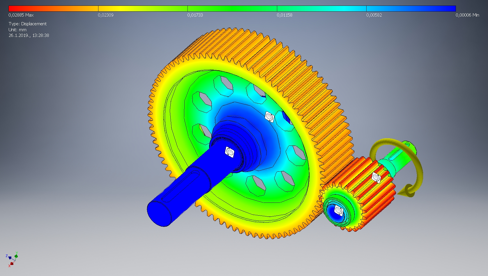

# Konstrukcije - Timski projektni zadatak

U ovom radu predstavljamo proračun strojnog sklopa - 1-stupanjskog reduktora zajedno s pripradajućim vratilima i ležajevima koji je zadan kao timski projektni zadatak iz kolegija Konstrukcije.

Projektni zadatak se sastoji od proračuna zupčanika, vratila i ležajeva sukladno [zadanim parametrima](https://github.com/KristijanCetina/Konstrukcije-TimskiProjektniZadatak/blob/master/TimskiProjektniZadatak.pdf).

3D model reduktora izrađen je uz pomoć [Autodesk Inventora](https://www.google.com/search?q=Autodesk+Inventor).

Detaljni tok proračuna je izrađen u [LaTeX](http://lmgtfy.com/?q=LaTeX) te kompajliran u .pdf dokument.  
[PDF verzija proračuna s nacrtom](https://github.com/KristijanCetina/Konstrukcije-TimskiProjektniZadatak/blob/master/Projektni%20zadatak_Cetina-Grgin-Mrkic.pdf)

Sve probleme i greške na koje naiđete slobodno ih prijavite na [Issues tabu](https://github.com/KristijanCetina/Konstrukcije-TimskiProjektniZadatak/issues).

## Uvedena su sljedeća pojednostavljena i zanemareni sljedeći dijelovi proračuna:

* kontrolni proračun
* izbor ulja za podmazivanje
* toplinski proračun
* određivanje stupnja korisnosti

Kod proračuna dimenzija zupčanika zanemareni su sljedeći proračuni:
* nosivost boka zuba
* sigurnost na _pitting_ (površinski zamor)
* nosivost korjena zuba

Kod proračuna vratila izrađena je samo kontrola na plastičnu deformaciju prema normi *DIN 743* te je zanemarena kontrola na zamor materijala.
